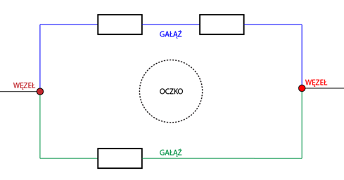

## 18.11.2022 – Podstawowy zestaw laboratoryjny i diagnostyczny

### Rodzaje prądu elektrycznego
Mówiąc o prądzie elektrycznym mamy na myśli zarówno:
- Zespół zjawisk fizycznych wywołanych występowaniem pola elektrycznego w środowisku. Jest to uporządkowany ruch ładunków elektrycznych w środowisku wywołany polem elektrycznym.
- Pewną wielkość skalarną $I$, zwanej natężeniem prądu elektrycznego. Jest to stosunek elementarnego ładunku elektrycznego Δq przenoszonego przez cząstki w ciągu pewnego czasu Δt, przez dany przekrój poprzeczny środowiska, czyli $I=\frac{Δq}{Δt}$, lub w zapisie ścisłym, używającym pojęcia pochodnej $I=\frac{dq}{dt}$.

[Bolkowski, Stanisław. „Elektrotechnika” r. 2.1. Warszawa 1999 WSIP, str. 19-20]

Jednostką natężenia prądu elektrycznego jest $1$ amper $[1 A]$. Jeżeli natężenie prądu nie zmienia się w czasie, mówimy, że jest prądem stałym, w innym przypadku mamy na myśli prąd zmienny.

### Prawo Ohma
Prawo Ohma mówi, że natężenie $I$ mierzone w przekroju przewodnika jest wprost proporcjonalne do napięcia $U$ na jego końcach, i odwrotnie proporcjonalne do rezystancji $R$. Otrzymujemy równanie matematyczne, które opisuje tę zależność:

$I=\frac{U}{R}$

```
I to natężenie prądu płynącego przez przewodnik,
U to różnica potencjałów między dwoma punktami przewodnika,
R to opór przewodnika. 
```
Dokładniej, prawo Ohma mówi, że $R$ w tej zależności jest stałe, niezależne od prądu. Prawo Ohma jest empiryczną zależnością, która dokładnie opisuje przewodnictwo ogromnej większości materiałów przewodzących prąd elektryczny. Jednak niektóre materiały bądź komponenty nie spełniają prawa Ohma. Wtedy mówimy o nich, że są nieomowe.

Prawo to zostało nazwane na cześć niemieckiego fizyka Georga Ohma, który w traktacie opublikowanym w 1827 roku opisał pomiary przyłożonego napięcia i prądu przez proste obwody elektryczne zawierające druty o różnej długości. 

Prawo Ohma posiada również wektorową postać uogólnioną.
$\vec{J}=\sigma\vec{E}$
- $\vec{J}$ to wektor gęstości prądu przechodzącego przez przekrój przewodnika,
- $\vec{E}$ to wektor pola elektrycznego mierzony w punkcie przewodnika, 
- $\sigma$ to konduktywność zależna od materiału, z którego został wykonany przewodnik.

Wektory gęstości prądu $\vec{J}$  oraz wektor pola elektrycznego $\vec{E}$ są opisywane między innymi przez prawo Faradaya oraz prawo Ampera. Owe dwa prawa, wraz z prawami Gaussa, połączył James Clerk Maxwell w roku 1861, postulując między nimi związek, który dziś nazywamy równaniami Maxwella.

### Prawa Kirchhoffa

Wraz z prawem Ohma dwa prawa Kirchhoffa stanowią podstawę teorii obwodów. Sformułowane w 1845r. wynikają z zasady zachowania energii. Dla przypomnienia podstawowych elementów obwodu elektrycznego zaznaczmy istnienie trzech zasadniczych pojęć: węzła, gałęzi i oczka.



- Węzeł – miejsce w obwodzie elektrycznym, z którego wychodzą co najmniej trzy przewody. Poszczególne węzły rozpoczynają lub kończą gałęzie.
- Gałąź – krzywa, będąca obrazem połączenia w obwodzie elektrycznym, tworzona przez jeden lub kilka połączonych ze sobą szeregowo elementów obwodu. Przez wszystkie elementy gałęzi przepływa ten sam prąd. Poszczególne gałęzie są oddzielane przez węzły.
- Oczko – zamknięta krzywa wraz z elementami, będąca obrazem fragmentu obwodu elektrycznego

Pierwsze prawo Kirchhoffa dotyczy bilansu prądów w węźle obwodu elektrycznego. Dla prądu stałego, dla każdego węzła obwodu elektrycznego, suma algebraiczna natężeń jest równa zeru:

$\sum_{k} I_k=0$

Wskaźnik $k$ przyjmuje wartości całkowite dodatnie, w zależności od liczby gałęzi zbiegających się w węźle obwodu. Przyjmujemy umownie, że natężenie wpływające do węzła mają wartość dodatnią, a wypływające z węzła wartość ujemną. 

Definicją formalną pierwszego Prawa Kirchhoffa dla prądu stałego jest, wobec tego następujące zdanie:

*Dla każdego węzła obwodu elektrycznego suma prądów wpływających do węzła jest równa sumie prądów wypływających z węzła*

Drugie prawo Kirchhoffa dotyczy bilansu napięć w oczku obwodu elektrycznego:

*W dowolnym oczku obwodu elektrycznego suma algebraiczna napięć źródłowych oraz suma algebraiczna napięć odbiornikowych występujących na rezystancjach rozpatrywanego oczka jest równa zeru.*

[Bolkowski, Stanisław. „Elektrotechnika”, Warszawa 1999, WSIP, str. 43-44]

$\sum_{k} U_k=0$


Wskaźnik k przyjmuje wartości całkowite dodatnie, w zależności od liczby elementów w rozpatrywanym oczku obwodu. Przyjmujemy umownie, że siły elektromotoryczne mają wartość dodatnią, a spadki potencjałów na odbiornikach ujemną.

### Multimetr

Multimetr to przyrząd pomiarowy, mierzący wiele właściwości elektrycznych, głównie napięcie $V$, prąd $I$ oraz rezystancję lub inaczej opór $R$. Niektóre multimetry posiadają funkcję pomiaru dodatkowych właściwości, takich jak temperatura $T$ i pojemność $C$, bądź wzmocnienie tranzystora $h_{FE}$, oraz są wyposażone w test diody.

Woltomierz dołącza się do obwodu równolegle. Idealny woltomierz to taki, który ma nieskończony opór. Gdy opór jest nieskończony, woltomierz nie pobiera prądu, a prezentuje on dokładne odczyty napięcia.

Amperomierz dołącza się do obwodu szeregowo. Idealny amperomierz to taki, który ma zerowy opór. Gdy opór jest zerowy, nie występuje spadek napięcia na amperomierzu, a prezentuje on dokładne odczyty natężenia. 

Wyróżniamy multimetry analogowe oraz cyfrowe.

### Oscyloskop

Oscyloskop to elektroniczny przyrząd testowy, który graficznie wyświetla napięcie elektryczne w postaci dwuwymiarowego wykresu jednego lub więcej sygnałów w funkcji czasu. Głównym celem jest wyświetlanie na ekranie powtarzających się lub pojedynczych przebiegów, które w innym przypadku występowałyby zbyt krótko, aby mogły być dostrzeżone przez ludzkie oko. Wyświetlany przebieg może być następnie analizowany pod kątem właściwości takich jak amplituda, częstotliwość, czas narastania, odstęp czasowy, zniekształcenia i inne. Pierwotnie w oscyloskopach analogowych, obliczanie tych wartości wymagało ręcznego pomiaru kształtu fali w stosunku do skali wbudowanej w ekran przyrządu. Nowoczesne instrumenty cyfrowe mogą obliczać i wyświetlać te właściwości bezpośrednio.