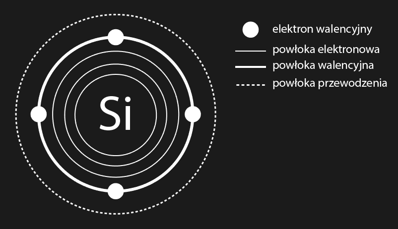
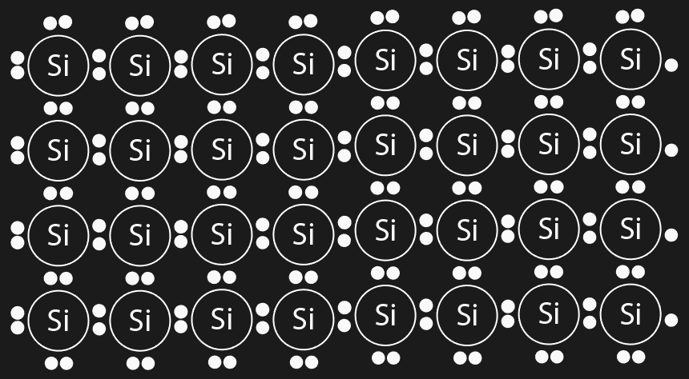

## 02.12.2022 – Półprzewodniki, diody i tranzystor bipolarny

### Przewodniki, izolatory, półprzewodniki

Pole elektryczne, wykonując prace, wynosi elektrony ponad powłokę przewodzenia w atomie:
- W przewodnikach typu miedź powłoka przewodzenia praktycznie pokrywa się z powłoką walencyjną, dzięki czemu elektrony mogą swobodnie opuszczać powłokę walencyjną i przemieszczać w sieci krystalicznej. Atom może również przyjmować elektrony, gdyż powłoka walencyjna nie jest wypełniona.
- W izolatorach typu styropian powłoka przewodzenia znajduje się wyraźnie dalej od jądra atomowego niż powłoka walencyjna, na której znajduje się zbyt dużo elektronów, by atom mógł przyjąć kolejne.
- Półprzewodnik typu krzem podstawowo działa jak izolator, natomiast powłoka przewodzenia jest na tyle blisko, że przy dostarczeniu relatywnie niewielkiej energii można wyprowadzić elektrony z powłoki walencyjnej i przemieszczać je w sieci krystalicznej. 

- **TYP N** Czysty krzem nie ma wielu wolnych elektronów, dlatego w procesie tworzenia półprzewodnika dodaje się do niego niewielką ilość materiału z wieloma wolnymi elektronami tworząc warstwę wzbogacaną. Np poprzez dodanie fosforu (który ma 5 zamiast 4 elektronów walencyjnych)
- **TYP P** Poprzez dodanie innego materiału, który ma bardzo mało wolnych elektronów tworzy się tzw. warstwę zubożałą. Na przykład przez dodanie glinu (który ma tylko 3 elektrony walencyjne).

Łączymy **typ P** oraz **typ N**. W wyniku tego, wskutek dyfuzyjnego przepływu elektronów, powstaje warstwa PN, która nazywana jest warstwą zaporową.

### Dioda półprzewodnikowa

Dioda to element elektroniczny posiadający dwa wyprowadzenia:
(+) Anoda --> Katoda (−)

Podstawowy model diody to idealna dioda prostownicza:
- Prąd może płynąć przez idealną diodę tylko w jednym kierunku.
- Dioda służy, wobec tego do ustalania kierunku płynięcia prądu
- Idealna dioda w kierunku przewodzenia jest idealnym przewodnikiem. W praktyce w wyniku oddziaływań międzycząsteczkowych w warstwie zaporowej $PN$ dochodzi do spadku potencjału $v_d$. Dla krzemu $V_{krzemu}=0.7V$
- Idealna dioda w kierunku zaporowym jest idealnym izolatorem. W praktyce występuje tzw. prąd upływu $I_L$
  
Pozostałe typy diod to również:
- Dioda LED - Źródło światła
- Dioda Zenera - Stabilizacja napięcia
- Dioda Schottky-ego - Działająca na wysokich częstotliwościach

O elektronach mówi się, że mają ładunek ujemny, a o ich braku (dziurach) że mają ładunek dodatni. W wyniku dyfuzji powstaje pole elektryczne, które nie pozwala poruszać się w tym samym kierunku pozostałym elektronom. W krzemie różnica potencjałów między tymi rejonami wynosi około $U_{krzemu}=0.7V$. W przypadku diod germanowych $U_{germanu}=0.4V$.

**Napięcie** przyłożone **w kierunku przewodzenia** powyżej spadku potencjału na diodzie sprawi, że popłynie prąd:
- $U>U_{spadku\ na\ diodzie}\Rightarrow \text{Przewodzenie}$

Napięcie przyłożone w kierunku zaporowym sprawi, że warstwa zaporowa powiększy się, a prąd nie popłynie. Jeżeli zostanie przekroczone napięcie zaporowe, to dioda ulegnie zniszczeniu.

- $U>U_{zaporowe}\Rightarrow \text{Uszkodzenie Diody}$

Parametry diody:
- Maksymalne napięcie zaporowe
- Napięcie przewodzenia
- Maksymalne natężenie płynące przez diodę

### Prostowanie napięcia mostkiem jedno- i dwupołówkowym

Dioda jest w stanie prostować napięcie. Zmieniać prąd AC w DC:
- Mostek pojedynczy - 1 dioda - Prostowanie połowy okresu 
$U\left(t\right)=U_0sin\left(\omega t\right)\Rightarrow$ 
$U=0 \text{ dla }sinωt<0$ $\vee$ 
$U=U_{0}sin(ωt) \text{ dla } sinωt≥0$
- Mostek Graetza (na schemacie) - 4 diody - Prostowanie pełnego okresu 
$U(t)=U_0sin(\omega t)\Longrightarrow \;U=\left|U_0sin\left(\omega t\right)\right|$
- Dioda zabezpiecza układ przed podłączeniem napięcia w sposób odwrotny (nieprawidłowy)

### Tranzystor Bipolarny NPN
Tranzystor jest najważniejszym przykładem elementu aktywnego. Jest to półprzewodnikowy element elektroniczny, które może wzmacniać, wytwarzając na wyjściu sygnał wyjściowy o większej mocy niż sygnał wejściowy. Ta dodatkowa moc pochodzi z zewnętrznego źródła zasilania. Jest podstawowym składnikiem każdego układu elektronicznego, od najprostszego wzmacniacza lub oscylatora, aż po najbardziej skomplikowany komputer cyfrowy. Układy scalone (IC), które w dużej mierze zastąpiły obwody zbudowane z tranzystorów dyskretnych, same są tablicami tranzystorów i innych elementów zamkniętych z pojedynczym układzie z materiału półprzewodnikowego.

[Horowitz. Paul. “The Art of Electronics”. Cambridge, Cambridge University Press 2015 str. 71-72]

Tranzystor bipolarny to element posiadający trzy wyprowadzenia:
- Baza (B)
- Kolektor (C)
- Emiter (E)

Traktując tranzystor bipolarny jako wzmacniacz prądowy, zakładamy w modelu, że prąd bazy jest proporcjonalny do prądu na kolektorze:

$I_C=\beta\cdot I_B$

Prąd $I_B$ wymusza przepływ prądu $I_C$, co pozwala tranzystorowi pełnić funkcję elektronicznego łącznika. Przez bazę płynie mały prąd, ponieważ w procesie wzbogacania baza jest wzbogacana znacznie mniej niż emiter i kolektor, dzięki czemu niewiele elektronów jest w stanie poruszać się z emitera do bazy, a znacznie więcej z emitera do kolektora.
