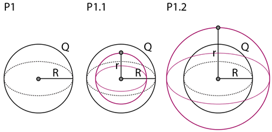
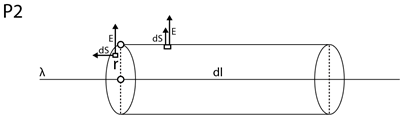
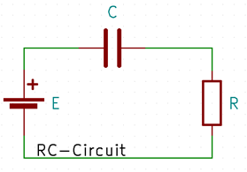

## 16.12.2022 – Kondensatory

### Prawo Gaussa dla elektryczności

Prawo Gaussa dla ładunku elektrycznego jest dane przez następujący wzór:

$\Phi=\int\int_{S}^{\ }{\vec{E}\cdot d\vec{S}}=\frac{Q}{\varepsilon_0}$

- $\phi$ to strumień pola elektrycznego przechodzącego przez powierzchnie $S$,
- $\vec{E}$ to wektor pola elektrycznego
- $\vec{S}$ to wektor powierzchni
- $Q$ to ładunek zamknięty w powierzchni Gaussa
- $\varepsilon_0$ to bezwzględna przenikalność elektryczna $\left[\varepsilon_0\right]=\frac{C}{Vm}=\frac{C^2}{N\ m^2}=\frac{C^2s^2}{kg\ m^3}=\frac{A^2s^4}{kg\ m^3}.$

Prawo możemy nieco uprościć w sytuacji, gdy kąt między dowolną częścią powierzchni, a wektorem pola elektrycznego jest stały. Możemy bez straty ogólności zapisać, że dla $E$ niezależnego od $S$ zachodzi:

$\int\int_{S}^{\ }{E\cdot d S}=E\int\int_{S}^{\ }dS=\Phi=E\cdot S\cdot\cos{\angle\left(E,S\right)}=\frac{Q}{\varepsilon_0}$

$\Phi=E\cdot S\cdot\cos{\angle\left(E,S\right)}=\frac{Q}{\varepsilon_0}$

Jednak, gdy kąt nie jest stały musimy podzielić powierzchnie na nieskończenie wiele infinitezymalnych części dla których powyższa operacja jest możliwa, a następnie zsumować powstałe strumienie pola elektrycznego. Wobec tego strumień elektryczny $\phi$ przechodzący przez powierzchnię $S$ można zapisać również jako całkę powierzchniową pola elektrycznego $E$ przechodzącego przez powierzchnię $S$.

$\Phi=\int{\int_{S}^{\ }{E\cdot d S}=\frac{Q}{\varepsilon_0}}$

Dodatkowym ułatwieniem jest możliwość przedstawienia całkowitego strumienia $\Phi_C$ przechodzącego przez powierzchnię Gaussa jako sumę strumieni przechodzących przez poszczególne ściany powierzchni. Fizycy powiedzieliby, wobec tego, że cechą wielkości fizycznej $\Phi$ jest addytywność.
Przykładowo dla walca całkowity strumień $\Phi_C={2\Phi}_P+\Phi_B$, gdzie $\Phi_P$ jest strumieniem przechodzącym przez powierzchnię podstawy walca, a $\Phi_B$ strumieniem przechodzącym przez jego powierzchnię boczną.
Całka powierzchniowa to całka, której obszarem całkowania jest płat powierzchni. Mówimy o niej również jako o całce powierzchniowej funkcji skalarnej i całce powierzchniowej pierwszego rodzaju.

### Przykłady wyznaczania pola elektrycznego jako funkcji stałej

Istnieją zasadniczo trzy przykłady, w których możliwe jest wyznaczenie stałego pola elektrycznego, niejako z ominięciem rachunku całkowego. Ideowo, w każdym z nich chcemy doprowadzić do przypadku, w którym wektory **pola elektrycznego $\vec{E}$** i **powierzchni Gaussa $\vec{S}$** mają taki sam zwrot, a wektor pola elektrycznego nie jest funkcją powierzchni Nie występuje wtedy potrzeba dzielenia obszaru powierzchni $S$ na infinitezymalne części.
Rozważmy pustą w środku kulkę o promieniu $R$, na której powierzchni znajduje się równomiernie rozłożony ładunek $Q$ (rysunek P1) Wyznacz pole elektryczne wokół i wewnątrz kulki.

Rozwiązanie: 
Wyobraźmy sobie powierzchnię sferyczną Gaussa o promieniu r, której środek znajduje się w środku kulki. Rozważmy dwa przypadki: 
1. Gdy promień r powierzchni od środka kulki wynosi $r\leq R$ (rysunek P1.1). Zauważmy, że w we wnętrzu powierzchni o promieniu $r\leq R$ nie znajduje się żaden ładunek, wobec tego pole elektryczne jest stałe i wynosi  $E=0$. 
2. Gdy promień r powierzchni od środka kulki wynosi $r\geq R$ (rysunek P1.2)
Zauważmy, że w we wnętrzu powierzchni o promieniu $r\geq R$ zamknięty jest cały powierzchniowy ładunek $Q$ naładowanej kulki. Zauważając równocześnie, że kulka jest ciałem symetrycznym możemy wnioskować, że wartość pola elektrycznego $E$ nie zależy od odległości od środka kulki.

Wobec tego możemy zapisać, że:

$\Phi=\int\int_{S} E\cdot dS=E\int\int_{S} d S=E\cdot S\cdot\cos(\alpha)=\frac{Q}{\varepsilon_0}$

$E\cdot S=\frac{Q}{\varepsilon_0}\Rightarrow E=\frac{Q}{S\cdot\varepsilon_0}$

$E=\frac{Q}{4\pi R^2\cdot\varepsilon_0}\blacksquare$

Rozważmy nieskończonej długości cienki pręt, którego gęstość liniowa ładunku wynosi $\lambda$ (rysunek P2)
Wyznacz pole elektryczne wokół pręta.

Rozwiązanie: 
Wyobraźmy sobie powierzchnię Gaussa o kształcie walca o promieniu $r$ i wysokości $dl$, którego oś symetrii znajduje się na pręcie. Z prawa Gaussa możemy w ogólności zapisać, że: 
$\Phi=\int\int_{S}^{\ }{\vec{E}\cdot d\vec{S}}=\frac{Q}{\varepsilon_0}$

Dla podstaw walca iloczyn skalarny wektorów $\vec{E}$ oraz $\vec{S}$ wynosi: 
 $E\cdot S\cdot\cos{\left(\frac{\pi}{2}\right)}=0$.

Zauważmy, że zgodnie z prawem Coulomba dla ładunku próbnego w dowolnym punkcie przestrzeni znajdującym się w niezerowej odległości od pręta pole elektryczne jest zwrócone w kierunku prostopadłym. Zauważmy jednocześnie, że zamknięty w powierzchni Gaussa ładunek $Q$ nie zależy od promienia walca $r$. Zapiszmy, wobec tego, że:

$\Phi=\int\int_{S}^{\ }{\vec{E}\cdot d\vec{S}}=\vec{E}\int\int_{S}^{\ }d\vec{S}=E\cdot2\pi r\cdot dl=\frac{Q}{\varepsilon_0}$

Znając zależność  $\lambda=\frac{Q}{dl}$:

$E\cdot2\pi r\cdot dl=\frac{Q}{\varepsilon_0}=\frac{\lambda\cdot d l}{\varepsilon_0}$

$E=\cdot2\pi r=\frac{\lambda}{\varepsilon_0}$

$E=\frac{\lambda}{{2\pi r\cdot\varepsilon}_0}\blacksquare$

Rozważmy nieskończoną płaszczyznę, której gęstość powierzchniowa ładunku wynosi \sigma (rysunek P3). Wyznacz pole elektryczne wokół płaszczyzny.

Rozwiązanie: 
Wyobraźmy sobie powierzchnię Gaussa o kształcie walca o polu powierzchni podstawy $dS$.
Dla ścian walca iloczyn skalarny wektorów $\vec{E}$ oraz $\vec{S}$ wynosi: 
$E\cdot S\cdot\cos{\left(\frac{\pi}{2}\right)}=0.$

Wiemy, że $Q=\sigma\cdot dS$. Z prawa Gaussa możemy zapisać, że:

$\Phi=\int\int_{S}^{\ }{\vec{E}\cdot d\vec{S}}=\frac{Q}{\varepsilon_0}=\frac{\sigma\cdot d S}{\varepsilon_0}$

Dla postaw walca iloczyn skalarny $\vec{E}$ oraz $\vec{S}$ wynosi 
$E\cdot S\cdot\cos{\left(0\right)}=E\cdot S.$ Wobec tego całkowity strumień przechodzący przez powierzchnię Gaussa wynosi:

$\Phi={2\cdot\phi}_p+\phi_s=2\cdot\phi_p=2\cdot E\cdot dS$

Możemy następnie zapisać równość:

$2\cdot E\cdot dS=\frac{\sigma\cdot d S}{\varepsilon_0}$

$E=\frac{\sigma}{2\cdot\varepsilon_0}\blacksquare$

Wydawać by się mogło, że analiza pola elektrycznego wokół elementów nierzeczywistych, posiadających przykładowo nieskończoną długość bądź nieskończone pole powierzchni, jest w istocie jedynie nieprzyjemnym żartem ze strony teoretyków. W praktyce jednak okazuje się, że przy dużej różnicy w skali elementów zastosowane przybliżenia, znacząco zmniejszają złożoność obliczeniową algorytmów symulujących układy elektroniczne. Dostarczają przy tym wystarczająco zbliżone do stanu rzeczywistego wartości. 

### Pojemności kondensatorów

Przykładem wykorzystania prawa Gaussa jest liczenie pojemności kondensatorów o różnych kształtach i polach elektrycznych. Aby obliczyć pojemność kondensatora wpierw, z użyciem prawa Gaussa wyznaczamy pole elektryczne jako funkcję położenia i ładunku $Q$. Następnie, całkujemy by znaleźć różnice potencjałów na okładkach kondensatora, a następnie ze wzoru ogólnego  $C=\frac{Q}{\Delta\ U}$ obliczamy pojemność kondensatora. Sama idea zapisana słownie może wydawać się nieco skomplikowana, jednak w praktyce często wiele rzeczy jest prostsze niż się wydaje, szczególnie po zapoznaniu się z przykładami.

#### Kondensator płaski

Kondensator płaski to element gromadzący ładunek, utworzony z dwóch równoległych do siebie płaszczyzn, które nazywamy okładkami. Załóżmy, że na każdej z nich znajduje się ładunek q oraz że odległość między nimi wynosi d Możemy przy użyciu prawa Gaussa zapisać, że:

$\int\int_{S}^{\ }{\vec{E}\cdot d\vec{S}}=\frac{q}{\varepsilon_0}$

Między okładkami powstaje pole jednorodne, co zostało wykazane wyżej w przykładzie trzecim. Wobec tego wektor pola elektrycznego nie zależy od S, dzięki czemu możemy zapisać, że:

$\varepsilon_0ES=q$

Dodatkowo wiemy, że różnica potencjałów między okładkami wynosi dla pola jednorodnego $U=Ed$, więc ze wzoru na pojemność kondensatora ustalamy, że:

$C=\frac{Q}{U}=\frac{\varepsilon_0ES}{Ed}=\frac{\varepsilon_0S}{d}$

Kondensator płaski z dielektrykiem
Rozważmy poprzedni przykład umieszczając między okładkami kondensatora pewien materiał gromadzący ładunek. Nazywamy go dielektrykiem. Niech na okładkach gromadzi się ładunek $q$, a na dielektryku ładunek $q^\prime$. Rozważając prawo Gaussa mamy:

$\int\int_{S}^{\ }{\vec{E}\cdot d\vec{S}}=\frac{q-q^\prime}{\varepsilon_0}$

Wtedy prawo Gaussa przybiera postać:

$\int\int_{S}^{\ }{\vec{E}\cdot d\vec{S}}=\frac{q}{\varepsilon_0\varepsilon_r}$

Z pola jednorodnego:

$\varepsilon_0\varepsilon_rES=q\$

$U=Ed$

Zatem pojemność kondensatora płaskiego z dielektrykiem wyraża się wzorem:

$C=\frac{Q}{U}=\frac{\varepsilon_0\varepsilon_rES}{Ed}=\varepsilon_0\varepsilon_r\frac{S}{d}$

### Ładowanie obwodu RC

Obwód $RC$ to obwód składający się z rezystora $R$ oraz kondensatora $C$. Do jego naładowania potrzebujemy dodatkowo źródła napięcia $\varepsilon$.
Głównym celem poczynionych następnie rozważań jest jawne wyznaczenie napięcia na kondensatorze w funkcji czasu $U_C(t)$. Do wyznaczenia funkcji przyda się znajomość podstawowych zależności takich jak prawa Kirchhoffa oraz rozwiązywanie liniowych równań różniczkowych pierwszego stopnia.

Dla obwodu, którego schemat widoczny jest powyżej możemy, z drugiego prawa Kirchhoffa, zapisać, że:

$\varepsilon-U_C-U_R=0$

Napięcie na kondensatorze wyraża się wzorem ogólnym $Q=UC$, więc uwzględniając $U_C=\frac{Q}{C}$:

$\varepsilon-\frac{Q}{C}-IR=0$

Weźmy pod uwagę, że prąd to zmiana ładunku $dQ$ w czasie $dt$:

$\varepsilon-\frac{Q}{C}-\frac{dQ}{dt}R=0$

Otrzymane równanie różniczkowe możemy rozwiązać metodą separacji zmiennych:

$\frac{C\varepsilon-Q}{RC}=\frac{dQ}{dt}$

$\frac{dQ}{C\varepsilon-Q}=\frac{dt}{RC}$

Całkując stronami otrzymujemy:

$\int\frac{dQ}{C\varepsilon-Q}=\int\frac{dt}{RC}$

$-\ln{\left(\left|C\varepsilon-Q\left(t\right)\right|\right)}=\frac{t}{RC}+K$

Zauważmy, że $C\varepsilon-Q\left(t\right)\geq0$, ponieważ $C\varepsilon=Q_{max}$ ze wzoru ogólnego $Q=UC$. Korzystając następnie z własności logarytmu naturalnego $\ln{\left(a\right)}=b\ \Rightarrow a=e^b$ zapiszemy:

$C\varepsilon-Q\left(t\right)=e^{-\frac{t}{RC}+K}=Ke^{-\frac{t}{RC}}$

Początkowo kondensator jest nienaładowany, a zatem ładunek znajdujący się na jego okładkach wynosi  $Q\left(t=0\right)=0$. Przyjmując to za warunek początkowy stała całkowania $K$ wyniesie:

$C\varepsilon=Ke^{-\ \frac{0}{RC}}=K$

Wobec tego dla niezerowej pojemności $C\neq0$ dokonujemy przekształceń algebraicznych:

$C\varepsilon-Q\left(t\right)=C\varepsilon\cdot e^{-\frac{t}{RC}}$

$Q\left(t\right)=C\varepsilon-C\varepsilon{\cdot e}^{-\frac{t}{RC}}$

$Q\left(t\right)=C\varepsilon\left(1-e^{-\frac{t}{RC}}\right)$

$U\left(t\right)C=C\varepsilon\left(1-e^{-\frac{t}{RC}}\right)$

$U\left(t\right)=\varepsilon\left(1-e^{-\frac{t}{RC}}\right)$

### Rozładowanie obwodu RC

Weźmy układ podobny do powyższego , składający się z połączenia rezystora o rezystancji $R$ i kondensatora o pojemności $C$, ale bez siły elektromotorycznej. Przyjmijmy, że w stanie początkowym ładunek na kondensatorze jest równy $Q_0$. Napięcie rezystora wynosi $U_R$, a napięcie kondensatora $U_C$, wobec czego zachodzi (z drugiego prawa Kirchhoffa):

[Zeldowicz. Yakow, „Matematyka wyższa dla początkujących.”, Warszawa 1976, Wydawnictwo Naukowo-Techniczne, str. 425-428]

$U_C\ -\ U_R\ =\ 0$

Wiedząc, że napięcie kondensatora wyraża się wzorem $U_C=\frac{Q}{C}$, mamy:

$\frac{Q}{C}-U_R=0$

Następnie korzystamy z prawa Ohma: $U_R=I_R\cdot R$, zatem:

$\frac{Q}{C}-I_R\cdot R=0$

Wartość prądu płynącego przez rezystor $R$ zależy od ładunku, który przepływa przez niego w czasie $t$. Możemy, wobec tego wyrazić $I$ jako:

$I=\frac{dQ}{dt}$

Powstaje następujące liniowe równanie różniczkowe pierwszego stopnia:

$\frac{Q}{C}-R\frac{dQ}{dt}=0$

$\frac{Q}{C}=R\cdot\frac{dQ}{dt}$

$\frac{1}{RC}dt=\frac{1}{q}dQ$

Zastosowana metoda separacji zmiennych. Zachodzi całkowanie stronami:

$\int\frac{1}{RC}dt=\int\frac{1}{Q}dQ$

$\frac{t}{RC}=ln\left(|Q|\right)+K$

Traktujemy $Q$ jako wartość ładunku, wobec tego przyjmuje wartość nieujemną:

$-\frac{t}{RC}=ln\left(Q\right)+K$

$-\frac{t}{RC}-K=ln\left(Q\right)$

$Q=e^{-\frac{t}{RC}-K}=e^{-\frac{t}{RC}}\cdot e^{-K}=Ae^{-\frac{t}{RC}}$

W celu wyliczenia stałej całkowania $A$ należy wprowadzić warunki początkowe w układzie. Niech rozładowanie kondensatora następuje od stanu naładowania ładunkiem $q_0$, wtedy:

$Q\left(t=0\right)=Q_0$

$Q\left(t=0\right)=Ae^{-\frac{t}{RC}}=A$

$q_0=A$

Wyraźmy ładunek $q$ kondensatora jako $=UC$. Zachodzi:

$Q\left(t\right)=Q_0e^{-\frac{t}{RC}}$

Pojemność kondensatora jest zmienną niezależna od czasu $\frac{dC}{dt}=0$, więc:

$U\left(t\right)\cdot C=U_0\cdot C\cdot e^{-\frac{t}{RC}}$

$U\left(t\right)=U_0\cdot e^{-\frac{t}{RC}}$

