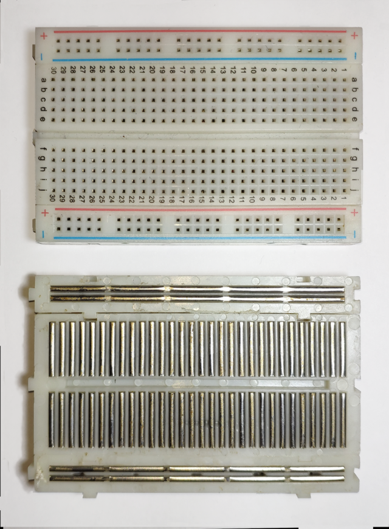
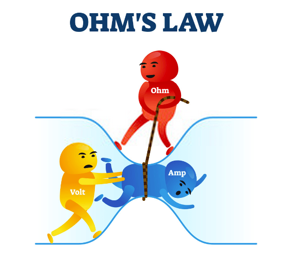
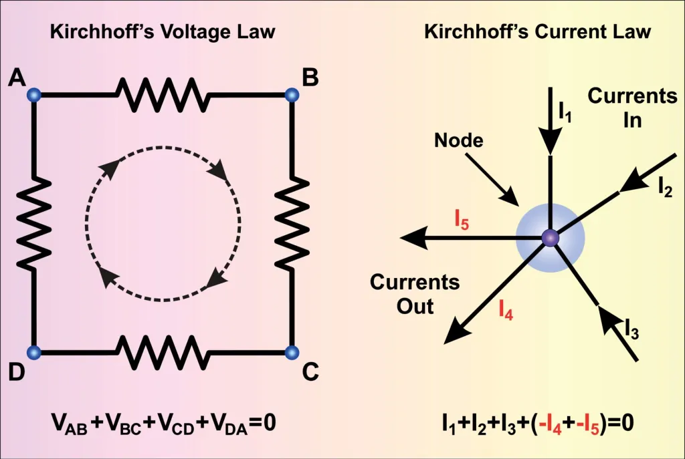
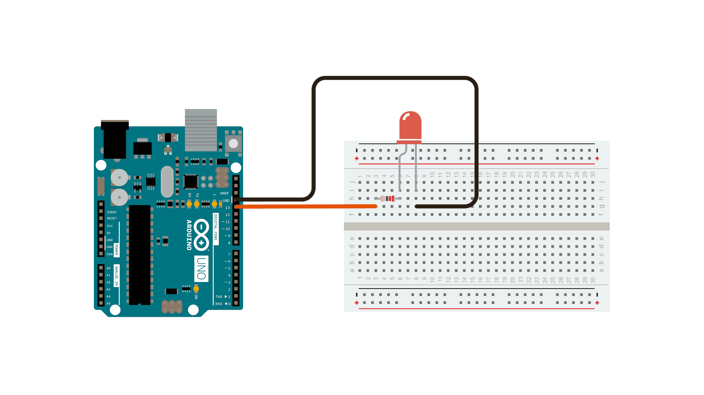
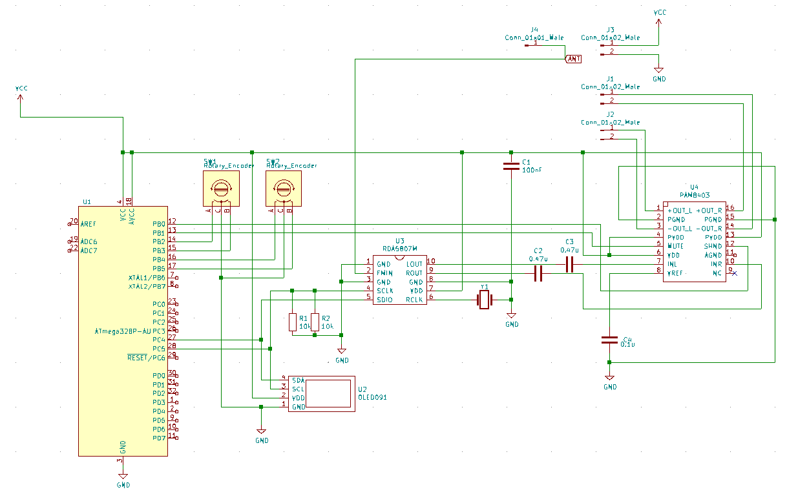
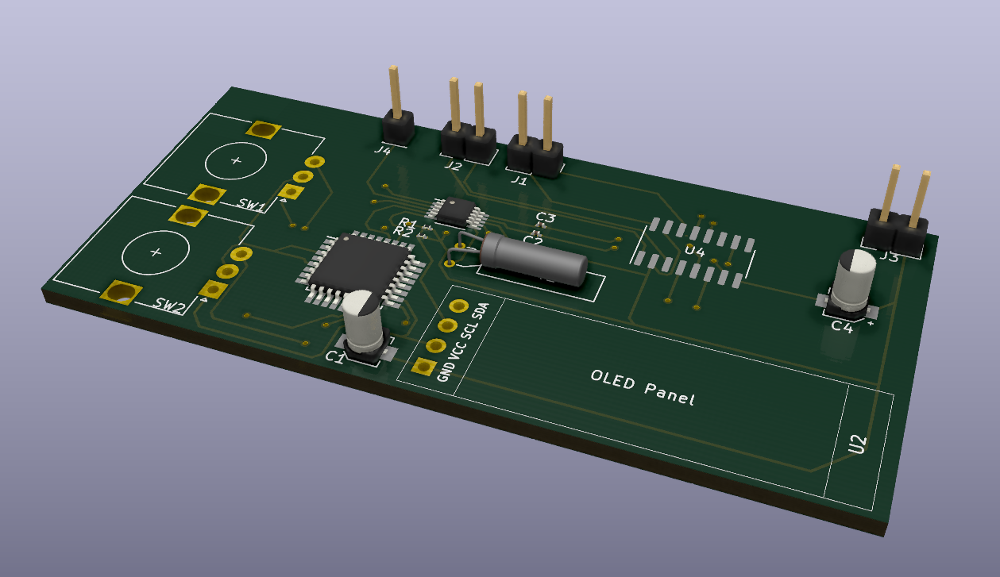

## Prototypowanie układów elektronicznych 

### Wprowadzenie do prototypowania 
Prototypowanie obwodów elektronicznych to proces tworzenia wstępnej wersji obwodu elektronicznego w celu oceny jego funkcjonalności, wydajności i zidentyfikowania wszelkich potencjalnych wad projektowych lub możliwych ulepszeń. Obejmuje fizyczne skonstruowanie obwodu na płytce prototypowej przy użyciu rzeczywistych komponentów elektronicznych.

### Schematy ideowe
Schematy ideowe pełnią kluczową rolę w uproszczonym portretowaniu działania i funkcjonalności projektu. Zerkając chociażby na poniższy schemat:

- [System Design Uber/Lyft oraz jego analiza pod kątem rozmów o pracę](https://www.youtube.com/watch?v=R_agd5qZ26Y)

Widzimy jak w uproszczonej formie przedstawione jest działanie całej struktury dużej firmy. Ukazuje to generalny przegląd wszystkich istotnych aspektów.
Tworzenie schematów ideowych nie uwzględnia szczegółów działania poszczególnych mechanizmów, ma jedynie przedstawić ogólny zarys działania.

### Podstawowe komponenty elektroniczne oraz schematy obwodów
Schematy elektroniczne to natomiast szczegółowe przedstawienie obwodu - części elektronicznej projektu. Poniżej przedstawiono schemat radia Diora Serenada 6299. Warto zwrócić uwagę na uproszczenia w schemacie, z którym jednak schemat wciąż zachowuje jednoznaczność. W rzeczywistości przykładowo połączenia zasilania są nieco bardziej skomplikowane, jednak dla czytelności zastosowano np. symbole uziemienia, zamiast rysowania poszczególnych przewodów.

### Jak szybko stworzyć prototyp
Do szybkiego stworzenia prototypów przydaje się płytka stykowa. Pozwala ona na relatywnie szybkie, choć nietrwałe połączenie ze sobą elementów elektronicznych w układ.
Jest ona wykorzystywana ze względu na swoją poręczność i łatwość w naprawianiu ewentualnych błędów.

Jak działają połączenia na płytce stykowej? Widać to na powyższym obrazku.

### Prawo Ohma oraz zwarcie
Prawo ohma $I=U/R$ definiuje, że natężenie prądu jest zależnością napięcia od rezystancji. Zwarcie występuje przy rezystancji zbiegającej do zera (same przewody).

Komponent nazywamy liniowym jeżeli spełnia on prawo Ohma. Przykładem komponentu nieliniowego jest chociażby dioda półprzewodnikowa.

### Prawa Kirchhoffa
Prawa Kirchoffa definiują jak rozkłada się napięcie oraz natężenie względem obwodu.

### Zasilanie
Różne typy zasilania - prąd stały DC, prąd zmienny AC. 
Każdy komponent potrzebuje zasilania określonym napięciem oraz wymaga określonego natężenia prądu.

### Charakterystyka Komponentów
Każdy komponent posiada tzw. notę katalogową - informacje od producenta jakie funkcje ma dany komponent, w jakim zakresie parametrów jest on przeznaczony do użytku, jakie są jego typowe zastosowania. Po angielsku ten termin nosi nazwę **datasheet**.

Analiza not katalogowych pozwala na poprawne wybranie współgrających ze sobą komponentów.

### Testowanie
Używamy multimetrów w celu mierzenia napięcia, natężenia, rezystancji oraz wykonywania testu diody. Używamy pozostałych funkcji miernika uniwersalnego do pomiaru wzmocnienia tranzystora, pojemności, indukcyjności.
Używamy oscyloskopu do graficznej reprezentacji napięcia w czasie, oraz w sytuacji gdy analizowany sygnał ma wysoką częstotliwość (ref. podstawa czasu).

Pozwala to na szybkie sprawdzenie zgodności połączeń i wykrycie niezgodności w działaniu konkretnych komponentów.

Falstad - symulator obwodów
Fritzing - proste schematy z arduino

### Bramki logiczne
Przeniesione na 3 zajęcia.

### Logika zdaniowa - upraszczanie
Przeniesione na 3 zajęcia.

### Bezpieczeństwo i zdrowe praktyki
- Główne zasady obcowania z prądem elektrycznym:
   - Nie wkładaj rąk do gniazdka.
- Pomocne informacje dot. organizacji pracy z układami elektronicznymi:
   - Zachowuj schemat, pliki programu oraz wszystkie elementy projektu w jednym miejscu. Twórz schemat, nawet gdy piszesz prosty program - automatycznie tworzy to dokumentacje twojej pracy.

### Zaawansowane techniki prototypowania
- Techniki prototypowania układów wysokoczęstotliwościowych (RF prototyping). Silnie wykorzystywane przy komunikacji bezprzewodowej.
- Specjalne płytki prototypowe zapewniające stabilniejsze połączenia - stripboards, perfboards

### Co potem?
- Opcje przejścia z prototypu w gotowy produkt.
- Tworzenie płytek PCB oraz fabrykacja - programy typu CAD - Computer Aided Design

