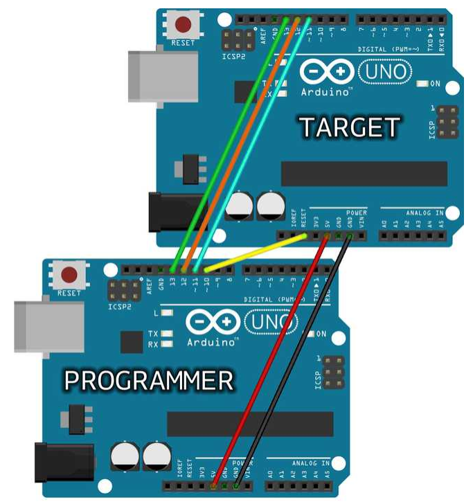
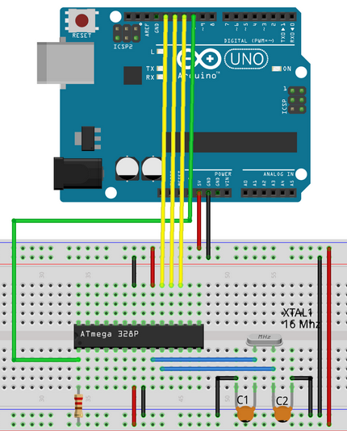

## Arduino Interrupts

W Arduino, jak i w innych mikrokontrolerach, interrupty (przerwania) są używane do obsługi zdarzeń, które występują w czasie rzeczywistym, niezależnie od wykonywanego właśnie kodu. Pozwala to na reagowanie na pewne zdarzenia natychmiast, bez konieczności ciągłego sprawdzania warunków w pętli głównej programu. Użycie interruptów zazwyczaj zwiększa efektywność i reaktywność programu.

Oto kilka powodów, dla których używa się interruptów w Arduino:

1. **Reakcja na zdarzenia w czasie rzeczywistym:** Jeśli istnieje potrzeba reagowania na zdarzenia, takie jak niski poziom sygnału na danym pinie, impuls z zegara czasu rzeczywistego (RTC), czy odbiór danych przez interfejs szeregowy (UART), interrupty pozwalają na błyskawiczne przerwanie wykonywania bieżącego kodu i przejście do obsługi zdarzenia.

2. **Precyzyjne pomiar czasu:** Dla zadań, które wymagają precyzyjnego pomiaru czasu, interrupty mogą być używane w połączeniu z timerami. Timer w mikrokontrolerze może generować przerwania w określonych odstępach czasu, co umożliwia dokładne śledzenie czasu.

3. **Odbieranie danych szeregowej (UART):** Gdy oczekuje się na dane przesyłane przez interfejs szeregowy (UART), korzystanie z przerwań pozwala na kontynuowanie innych operacji w trakcie oczekiwania na dane, zamiast blokować pętlę główną.

4. **Obsługa wejść/wyjść cyfrowych:** Przerwania mogą być używane do obsługi zmian stanu na pinach cyfrowych, co jest przydatne, na przykład, w przypadku obsługi przycisków lub czujników.

5. **Zegar czasu rzeczywistego (RTC):** W przypadku korzystania z modułów RTC, interrupty mogą być używane do obsługi minut lub sekund, co pozwala na precyzyjne zarządzanie czasem w programie.

Przerwania w Arduino można konfigurować przy użyciu funkcji takich jak `attachInterrupt()`. Warto jednak pamiętać, że obsługa interruptów wymaga ostrożności, aby uniknąć problemów związanych z konkurencją i dostępem do zasobów współdzielonych.

Kilka przydatnych artykułów:
- [Artykuł o przerwaniach](https://www.arduino.cc/reference/en/language/functions/external-interrupts/attachinterrupt/)
- [Przykład programów z przerwaniami](https://www.arduino.cc/en/Tutorial/BuiltInExamples/Interrupts)
- [Drugi przykład z przerwaniami (j.niemiecki)](https://www.mikrocontroller.net/articles/Verwendung_von_Interrupts_mit_Arduino)

## Arduino as ISP oraz bypass programatora

Można za pomocą jednego arduino zaprogramować drugie arduino, inny mikrokontroler, bądź nawet bezpośrednio mikroprocesor (np. Atmega328p).

#### Sposób pierwszy - Interfejs SPI - Arduino as ISP (In-System Programming)

Zachęcam do zapoznania się z [oficjalnym artykułem arduino](https://docs.arduino.cc/built-in-examples/arduino-isp/ArduinoISP)



Ideowo dochodzi tutaj do:
1. Połączenia dwóch płytek - zasilanie plus przewody interfejsu SPI
2. Wgrania programu ArduinoISP na jedną z płytek
3. Wgrania programu na drugą płytkę za pomocą pierwszej płytki



Podobnie prezentuje się ta sytuacja, w której zamiast drugiej płytki mamy bezpośrednio mikrokontroler.

### Sposób drugi - Bypass programatora

Dla arduino UNO można zewrzeć piny RESET z GND otrzymując bypass, który pozwala na wgranie programu bezpośrednio z komputera.
Wystarczy jedynie:
1. Podłączyć płytki do zasilania
2. Podłączyć piny na **pierwszej** płytce: `RESET` z `GND`
3. Podłączyć piny **dwóch płytek**: `RX` z `TX` oraz `TX` z `RX`
4. Wgrać program *bezpośrednio* na drugą płytkę

## Operacje logiczne

**Rachunek Zdań** jest działem logiki matematycznej badającym związki pomiędzy
zdaniami utworzonymi ze zmiennych zdaniowych ża pomocą spójników logicznych.
W klasycznym rachunku zdań [...] przyjmuje się, że każdemu zdaniu można przypisać
jedną z dwóch wartości logicznych - **prawdę** lub **fałsz**.

Definiujemy następujące operacje logiczne:

|  p  |  q  | NOT p | p AND q | p OR q | p XOR q | p => q | p <=> q |
| --- | --- | ----- | ------- | ------ | ------- | ------ | ------- |
|  1  |  1  |   0   |    1    |   1    |    0    |   1    |    1    |
|  1  |  0  |   0   |    0    |   1    |    1    |   0    |    0    |
|  0  |  1  |   1   |    0    |   1    |    1    |   1    |    0    |
|  0  |  0  |   1   |    0    |   0    |    0    |   1    |    1    |

## Szyfrowanie metodą XOR

Rozważmy następujące zależności dla operacji $\oplus$ XOR:

$A \oplus 0 = A$

$A \oplus A = 0$

$A \oplus B = B \oplus A$

$(A \oplus B) \oplus C = A \oplus (B \oplus C)$

$(B \oplus A) \oplus A = B \oplus 0 = B$

Szyfrowanie metodą XOR uznaje się za jednorazowe, gdyż przy użyciu takiego samego klucza do dwóch wiadmości, dla potencjalnego łamacza szyfrów istnieje tylko jedna permutacja `0, 1`, dla których przetłumaczone zostaną jednocześnie dwie wiadomości.

Zauważmy, że (cytując Wikipedię):

> If the key is random and is at least as long as the message, the XOR cipher is much more secure than when there is key repetition within a message. When the keystream is generated by a pseudo-random number generator, the result is a stream cipher. With a key that is truly random, the result is a one-time pad, which is unbreakable in theory. 

W idealnych warunkach jest to szyfr nie do złamania metodami matematycznymi.

Poniżej znajduje się program do szyfrowania tą metodą. Sprawdź jego działanie z [przykładem na Wikipedii](https://en.wikipedia.org/wiki/XOR_cipher)

W celu praktycznego zilustrowania napisałem w języku *python* [program](./7_20.11.2023xorcipher.py) szyfrujący, deszyfrujący i podmieniający klucz gotowego szyfru za pomocą operacji XOR.
Funkcje programu:
- `-e (encode)` - Szyfruje `tekst` podany przez użytkownika za pomocą `klucza wygenerowanego` przez program
- `-d (decode)` - Deszyfruje `szyfr` podany przez użytkownika za pomocą `klucza` podanego przez użytkownika
- `-s (spoof)` - Tworzy nowy `klucz` dla `szyfru` podanego przez użytkownika, uzyskujący `żądany wynik` podany przez użytkownika

W przypadkach `-d` `-s` zakłada się, że oba podane przez użytkownika parametry są zapisane jako `tekst utf-8` bądź `grupy 8 bitów oddzielone spacjami` oraz ich długość wynosi tyle samo bajtów.


Przykładowe wyjście programu:

encode:
```
The following program encrypts your text using bitwise XOR operator.
Key is auto-generated on each input
Enter text to xorencrypt (CTRL+D to quit):
hello
msg 01101000 01100101 01101100 01101100 01101111
key 11001001 01100101 10010111 01110110 00100000
cyp 10100001 00000000 11111011 00011010 01001111
```

decode:
```
The following program decrypts your text using bitwise XOR operator.
Enter cipher to xordecrypt (CTRL+D to quit):
10100001 00000000 11111011 00011010 01001111
Enter key:
11001001 01100101 10010111 01110110 00100000
raw 10100001 00000000 11111011 00011010 01001111
key 11001001 01100101 10010111 01110110 00100000
msg 01101000 01100101 01101100 01101100 01101111
res hello
```
