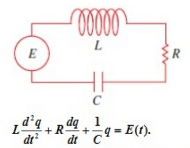
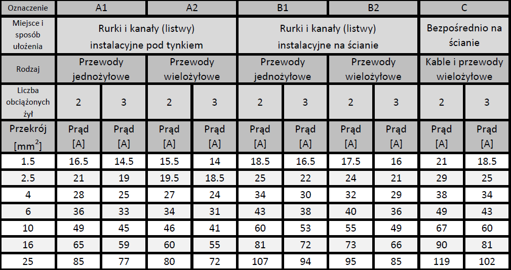

Przeczytaj [2022-class-01](./../../2022/1_18.11.2022notes.md)

### Trudniejsze obwody.

Kirchhoff's laws:

### Eksperyment

1. Dzielnik napięcia złożony z dwóch rezystorów. Wartość oczekiwana i rzeczywistość.
2. Dzielnik napięcia po podłączeniu kolejnego oporu do środkowego zacisku.

### Prawo Joule'a

Prawo Joule'a mówi, że moc cieplna $P$ wydzielana w przewodniku o oporze $R$ jest wprost proporcjonalna do kwadratu natężenia prądu $I$ płynącego przez przewodnik oraz do rezystancji $R$ przewodnika.

$P=I^2 \cdot R$

1. Pytanie kontrolne. Dlaczego linie dalekie przesyłowe są zawsze liniami wysokiego napiecia?

2. Policzmy jakie napięcie musimy podać na rezystor o oporze $R=10\Omega$ oraz zdolności wydzielana ciepła $P=1/4W$ musimy podać, aby go spalić.

3. Różne [średnice przekrójów przewodów instalacji elektrycznej](https://elektrykadlakazdego.pl/wyznaczanie-przekroju-przewodow/):

P
- skąd wiemy że ta moc wydzielana idzie dokładnie na ciepło
- doładowywanie obwodu lrc za pomocą układu na tranzystorze