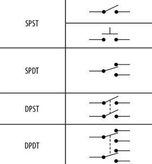
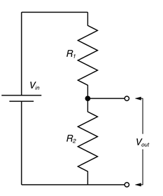

## 13.01.2023 – Elementy wprowadzające dane

### Łączniki

Wyróżniamy łączniki chwilowe, czyli monostabilne oraz stałe, czyli bistabilne. Łączniki chwilowe po naciśnięciu i puszczeniu wracają do stanu początkowego, a stałe wymagają ponownego naciśnięcia, aby powrócić do stanu początkowego. Łączników monostabilnych używamy, gdy chcemy korzystać z informacji w postaci impulsów, a bistabilnych, gdy chcemy otrzymywać informację w postaci sygnału ciągłego. Możemy utworzyć różne mechaniczne konfiguracje łączników, wobec tego powstał standard klasyfikujący większość z nich. 

Pierwszy dwuznakowy człon czteroznakowego systemu nazewnictwa oznacza liczbę przewodów wchodzących do łącznika. SP oznacza Single Pole, czyli jeden przewód wchodzący. Analogicznie dwa przewody to DP - Double Pole. 

Drugi dwuznakowy człon oznacza liczbę przewodów wychodzących przypadających na jeden przewód wchodzący. Jeżeli zatem dla jednego przewodu wchodzącego możemy wybrać tylko jedno połączenie wychodzące, to mówimy, że jest on ST, czyli Single Throw. Jeżeli na dwa to jest to DT, czyli Double Throw. 

Każda kolejna liczba większa od dwa jest zapisywana przy użyciu cyfr. Łącznik posiadający jeden przewód, na który przypada 6 możliwości połączenia nazywamy łącznikiem SP6T.

Schemat obejmuje dodatkowo wyróżnienie między łącznikiem bistabilnym SPST (na górze), a monostabilnym (na dole). Linia przerywana w łącznikach DPxx oznacza mechaniczne połączenie między częściami łącznika. Brak linii przerywanej powinien być traktowany jako kilka różnych łączników, będących jedynie obok siebie na schemacie.

### Enkodery

Enkoder to element elektroniczno-mechaniczny przekształcający ruch obrotowy lub liniowy w informacje elektroniczną. Enkoder zazwyczaj posiada jeden monostabilny łącznik SPST oraz trzy wyprowadzenia, z których jedno pełni formę uziemienia. Mechanicznie na pozostałych dwóch wyprowadzeniach tworzona jest tablica prawdy, której analiza logiczna może zdeterminować kierunek ruchu. Najprościej można to osiągnąć tworząc na nich trzy możliwe sygnały logiczne, na przykład $\left(p,q\right)={\left(0,0\right),\left(0,1\right),(1,0)}$/ Zapisujemy pozycję enkodera, następnie przy jej zmianie sprawdzamy, czy wartość jest mniejsza czy większa, co odpowiada ruchowi w lewo lub prawo.

### Potencjometry i trymery

Potencjometr to element elektroniczny posiadający trzy wyprowadzenia, mogący spełniać dwie funkcje:
- Rezystora nastawnego
- Dzielnika napięcia

W pierwszej sytuacji dwa z trzech wyprowadzeń są zwierane, a mechaniczny ruch powoduje zwieranie części rezystora nastawnego wewnątrz, co zmienia rezystancje potencjometru.

W drugiej sytuacji łączymy dwa skrajne wyprowadzenia, na środkowym otrzymując wynik dzielnika napięcia. 

Dla dzielnika napięcia zachodzi wzór ogólny:

$U_{wyj}=U\frac{R_2}{R_1+R_2}$

Trymer to element podobny do potencjometru, jednak mechanicznie stworzony i przystosowany do pracy wewnątrz obudowy, z możliwością ustawienia pozycji przy użyciu śrubokręta. Bardzo często stosowany jest do wyrównywania nieprawidłowej charakterystyki obwodu wynikającej z dużej tolerancji produkcyjnej pozostałych elementów układu.
