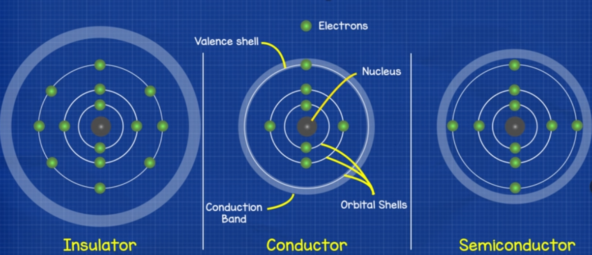
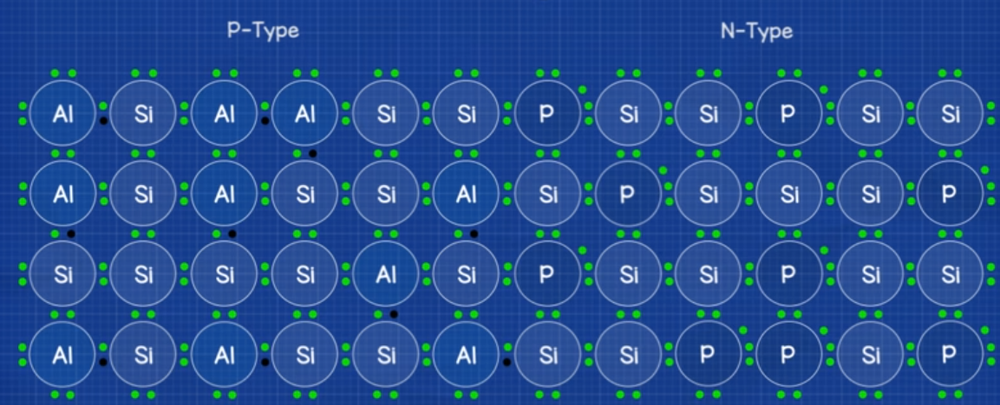
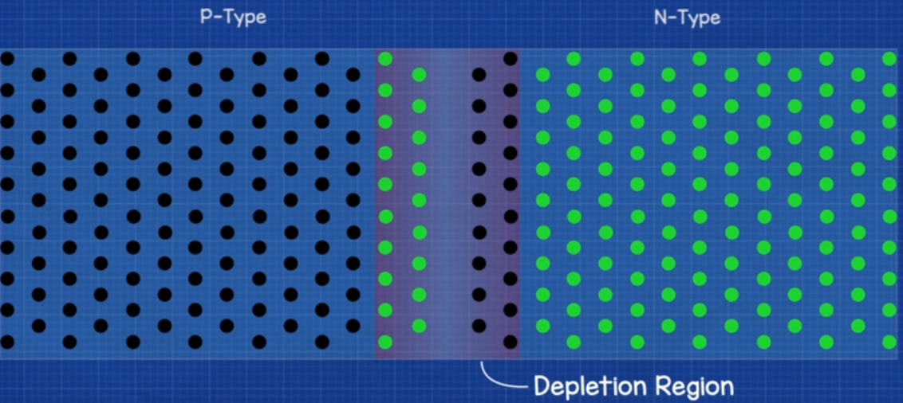
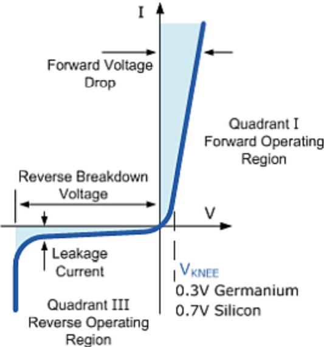
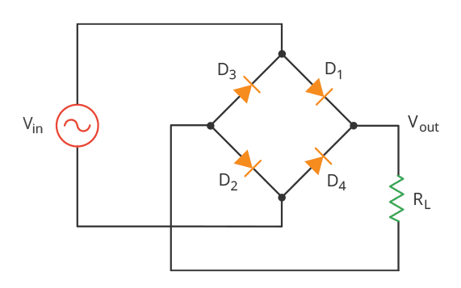
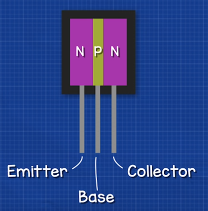
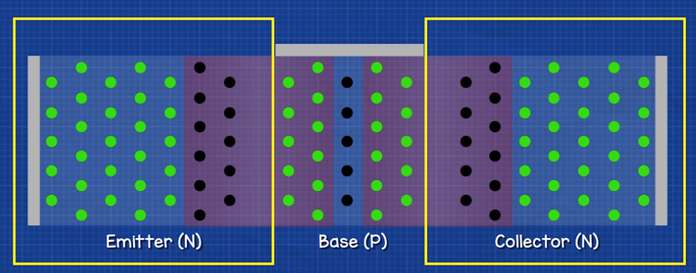
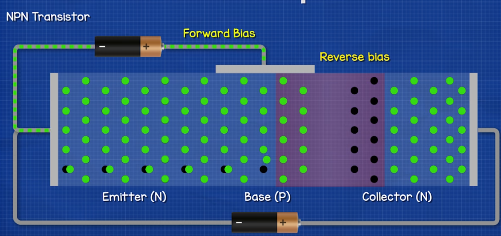

### Dioda

- Dioda to element elektroniczny posiadający dwa wyprowadzenia: 
    $(+)$ Anoda --> Katoda $(-)$
- Podstawowa dioda to dioda prostownicza: 
    Prąd może płynąć przez diodę tylko w jednym kierunku
    Dioda służy wobec tego do ustalania kierunku płynięcia prądu
    Idealna dioda w kierunku przewodzenia jest idealnym przewodnikiem
    Idealna dioda w kierunku zaporowym jest idealnym izolatorem

Do przewodzenia dochodzi poprzez ustawienie powłoki przewodzenia w atomie:
- W przewodnikach typu **miedź** powłoka przewodzenia praktycznie pokrywa się z powłoką walencyjną, dzięki czemu elektrony mogą swobodnie odrywać się i przesuwać dalej
- W izolatorach typu **styropian** powłoka przewodzenia jest zbyt odległa oraz elektronów na powłoce walencyjnej jest zbyt dużo żeby mogły się one oderwać. Nie są w stanie wobec tego opuścić atomu
- Półprzewodnik typu **krzem** działa jak izolator, natomiast powłoka przewodzenia jest na tyle blisko, że przy dostarczeniu relatywnie niewielkiej energii jesteśmy w stanie przesunąć niektóre elektrony powyżej powłoki walencyjnej 

Tworzenie warstw półprzewodnikowych (Doping):

**TYP N** Czysty krzem nie ma wielu wolnych elektronów, dlatego w procesie tworzenia półprzewodnika dodaje się do niego niewielką ilość materiału z wieloma wolnymi elektronami tworząc warstwę wzbogacaną. Np poprzez dodanie fosforu (który ma 5 zamiast 4 elektronów walencyjnych)
 
**TYP P** Poprzez dodanie innego materiału, który ma bardzo mało wolnych elektronów tworzy się tzw. warstwę zubożałą. Na przykład przez dodanie glinu (który ma tylko 3 elektrony walencyjne)
 

Łączymy typ P oraz typ N. W wyniku tego, wskutek dyfuzyjnego przepływu elektronów, powstaje warstwa PN, która nazywana jest warstwą zaporową (Depletion Region). 

O elektronach mówi się że mają ładunek ujemny, a o ich braku (dziurach) że mają ładunek dodatni.
W wyniku dyfuzji powstaje pole elektryczne, które nie pozwala poruszać się w tym samym kierunku pozostałym elektronom. W krzemie różnica potęcjałów między tymi rejonami wynosi około 0.7V

**Napięcie** przyłożone w **kierunku przewodzenia** powyżej spadku napięcia na diodzie sprawi, że **popłynie prąd**.

**Napięcie** przyłożone w **kierunku zaporowym** sprawi, że warstwa zaporowa powiększy się, a prąd **nie popłynie**.

Parametry diody:
- Maksymalne napięcie zaporowe
- Napięcie przewodzenia
- Maksymalne natężenie płynące przez diodę

Zastosowania:
- Dioda jest w stanie prostować napięcie - Mostek pojedyńczy, Mostek Graetza (full bridge rectifier) - Zmieniać prąd AC w DC.
- Dioda zabezpiecza układ przed podłączeniem napięcia w sposób odwrotny (nieprawidłowy)

Woltomierz:
- Test Diody testuje diodę w kierunku przewodzenia i zaporowym.

### Tranzystor

Tranzystor służy głównie jako:
- Łącznik
- Wzmacniacz sygnału

Tranzystor to element elektroniczny z trzema wyprowadzeniami:
- (B) Baza
- (C) Kolektor
- (E) Emiter

Strzałka na symbolu wskazuje konwencjonalny przepływ prądu.

**Wzmocnienie Tranzystora** 
$\beta=\frac{I_c}{I_b}$

Warstwy półprzewodnikowe w tranzystorze NPN

Poprzez podanie wystarczającego napięcia między bazą a emiterem zajdzie przewodzenie prądu z bazy do emitera, jak w normalnej diodzie.

Przez bazę płynie mały prąd, ponieważ w procesie wzbogacania baza jest wzbogazana znacznie mniej niż emiter i kolektor, dzięki czemu niewiele elektronów jest w stanie poruszać się z emiter do bazy.

Poprzez podanie wystarczającego napięcia między bazą a emiterem i podanie napięcia między bazą a kolektorem dochodzi do przewodzenia między kolektorem a emiterem. Niewielka liczba elektronów przechodzi wówczas z emitera do bazy, a wielka liczba elektronów przechodzi z emitera do kolektora.

### Podstawowe układy na tranzystorze

- Switch
- Bramki logiczne